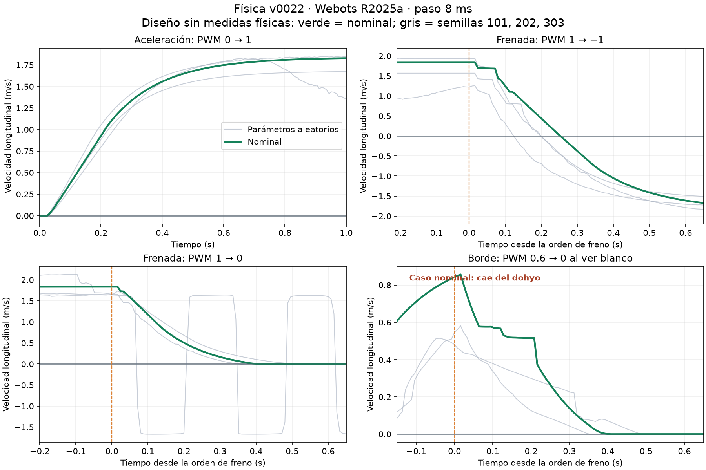

# Informe Webots · Gelatina Nuclear

Fecha: 13 de septiembre de 2026. Física final: **v22**, SHA-256 `5650b9b0bd2afc9b6922658164da4c9c453c2bea3d4efe5ca71d95623af44519`. Webots **R2025a**, paso **8 ms**.

El proyecto sigue siendo un diseño: el usuario confirmó que **no existe un robot físico medido**. Se implementó y ensayó una planta más detallada, con datos de catálogo y supuestos explícitos. Esto permite identificar riesgos de transferencia; **no demuestra que quien gane en Webots ganará en el dohyo real**.

En los **cuatro rivales compartidos con la línea base**, v0.3.1 pasa de114/120 victorias (95%) a88/120 (73.3%) con la planta final nominal: una caída de21.7 puntos porcentuales sin modificar su estrategia. Contra los cinco rivales finales obtiene108/150 victorias nominales y110/150 aleatorias; la red neuronal obtiene70/150 y80/150. No se recuperaron resultados ajustando parámetros físicos para favorecer una versión.

La fuente de verdad es `data/lab.sqlite3`, mediante `Store`. El paquete `webots_real/` conserva C, HAL, física, sensores, árbitro y parámetros de cada revisión. Las cinco estrategias históricas y sus `params.h` se conservaron sin ajustes. `v0022` identifica la plataforma del laboratorio; `v0.3.1`, por ejemplo, identifica el algoritmo histórico ejecutado dentro de ella. `--revision N` selecciona una copia inmutable; no solicita N repeticiones.

## Entregables y trazabilidad

- [Copia del proyecto](Mini-Sumo-real/), aislada del proyecto de Claude.
- [Calibración: series cada 8 ms, condiciones, resúmenes y rangos](calibracion_webots.json).
- [Protocolo de medidas físicas](PROTOCOLO_MEDIDAS_REALES.md).
- [Matriz final y referencias a los 120 manifiestos](Mini-Sumo-real/runs/evaluacion_final.json).
- [Vista breve del avance solicitada por el usuario](REVISION_DEL_AVANCE.md).
- [Curvas de calibración](artifacts/calibracion-v0022.png), también en [SVG](artifacts/calibracion-v0022.svg).
- Historial visible en `https://byemmanuel.github.io/Sumo_Page//#versions`; evaluación en `#simulation`. La ficha anterior de 460 g se conserva identificada como modelo inicial.

Cada ejecución conserva mundo generado, PROTO, fuentes, binarios, hashes SHA-256, semilla, parámetros, salida bruta, compilación y log de Webots. `evaluacion_final.json` enlaza cada manifiesto y su hash. No se ejecutan borradores de combate. Las observaciones no cambian los hashes de las versiones.

No se editó, compiló ni hizo git en `claude/`. Se reutilizó su intérprete de Python y bibliotecas PyTorch **solo en CPU**, con escritura de bytecode desactivada, para comparar la red de la copia. No se entrenó ni cambió la red. Los puertos de Webots usados están en 1300 o superiores; la revisión visual usa 1340. No se publicó en GitHub ni se modificó la `.git` raíz.

## Línea base: coincidencia exacta

La copia original reprodujo las cuatro tandas requeridas, antes de cambiar la física. 30 asaltos × cuatro rivales por fila, semilla Webots 0. Evidencia: [real_baseline](Mini-Sumo-real/runs/real_baseline/).

| Algoritmo | Reglamento V / D / E | Auto-salidas | Combate ganado medio calculado | Banco diagonal V / D / E |
|---|---|---|---|---|
| v0.3.0 | 49 / 68 / 3 | 63 | 25.9% | 99 / 20 / 1 |
| v0.3.1 | 114 / 6 / 0 | 0 | 100% | 89 / 31 / 0 |

“Combate ganado” es la combinación probabilística que calcula el árbitro a partir de las frecuencias por colocación; no equivale a torneos de tres rondas observados. En lo que sigue se priorizan los recuentos reales de asaltos.

## Cambios, fuentes y comparaciones

La tanda común por etapa usa **v0.3.1**, reglamento, cuatro rivales (`static`, `charger`, `spinner`, v0.3.0 congelada), 30 asaltos por rival, nominal y semilla 0. La medición de una etapa sirve de “antes” de la siguiente. No se seleccionó la física por la puntuación.

| Revisión | Edición independiente | V / D / E en 120 | Auto-salidas | Interpretación |
|---|---|---|---|---|
| 4 | Importación de fuentes originales | Línea base anterior | — | Archivo de referencia |
| 5 | Instrumentación de planta | 114 / 6 / 0 | 0 | Reproduce la línea base |
| 6 | A: primera implementación eléctrica | Rechazada | — | Derivada inicial de encoder incorrecta; pico de par artificial |
| 7 | Inicializar derivada con primera lectura | 104 / 16 / 0 | 0 | Motor eléctrico aceptado para continuar |
| 8 | B: fricción y deslizamiento | 106 / 12 / 2 | 0 | Distribuciones exploratorias, no medidas |
| 9 | B: prueba de colisión de ruedas poligonal | 109 / 11 / 0 | 1 | **Rechazada**: deriva lateral de más de 0.5 m en 1 s |
| 10 | Reversión de la rueda a v8 | No repetida | — | Copia nueva; contenido físico restaurado |
| 11 | B: malla cerrada del dohyo | 106 / 13 / 1 | 0 | Mantiene las ruedas cilíndricas y la marcha plana |
| 12 | C: ToF con abanico, cadencia y ruido | 93 / 25 / 2 | 4 | Disminuye el rendimiento; se conserva |
| 13 | D: QTR analógicos, ADC y retardo | 89 / 28 / 3 | 4 | Conserva respuesta a pala clara |
| 14 | E: I2C secuencial y retardo PWM | 99 / 17 / 4 | 1 | Un paso de retardo de actuación |
| 15 | F: espera de 5 s, giro de colocación y 60 s | 84 / 31 / 5 | 6 | Mismos cuatro rivales |
| 16 | G: rival de flanco | 24 / 4 / 2, **30** asaltos | 0 | Nuevo rival, no comparable con una fila de 120 |
| 17 | Controlador neuronal y diagnóstico de paridad | Paridad cerrada fallida | — | Se conserva el fallo |
| 18 | Comparación con historial común grabado | Paridad local aprobada | — | Limitación de realimentación sigue abierta |
| 19 | Pista diagnóstica ampliada y frenada a 1504 ms | Calibración | — | Evita colisiones con el rival al acelerar nominalmente |
| 20 | Incertidumbre independiente por rueda, rotor y reinicio de semillas | Aleatorización incompleta | — | Webots rechazó la escritura de inercia interna |
| 21 | Telemetría de orientación para interpretar frenadas | Aleatorización incompleta | — | Corridas nominales útiles; aleatorias rechazadas para la matriz final |
| 22 | Exponer inercias del PROTO y verificar su aplicación | Matriz completa abajo | — | Una plataforma final común, sin ajustes posteriores por victoria |

Las pruebas fallidas permanecen en [runs/real](Mini-Sumo-real/runs/real/) con `assessment.json` o estado `failed`. En las ejecuciones históricas v20–21, el resultado bruto conserva su estado original de finalización, pero `assessment.json` declara que la aleatorización no es válida. El ejecutor actual rechaza errores de Webots aunque el árbitro haya producido 30 resultados. No confundir ejecución terminada con modelo validado.

### A. Motor, puente y batería

Datos actuales de [Pololu #3063](https://www.pololu.com/product/3063/specs): 6 V, 650 rpm ±20%, corriente sin carga 0.15 A ±50%, corriente de bloqueo extrapolada 1.5 A y par extrapolado 0.74 kg·cm. Reducción 51.45:1. El valor sin carga de algunos documentos antiguos es 0.10 A; se adoptó la ficha actual de 0.15 A y se conservó un rango amplio.

Se infieren:

- `R = 6 / 1.5 = 4 Ω`.
- `Kt = (0.74 × 0.0980665) / 1.5 = 0.0483795 N·m/A` en el eje de salida.
- `Ke = (6 − 0.15 × 4) / (650 × 2π/60) ≈ 0.07933 V·s/rad`.
- `i = (u Vbat − Ke ω) / (R + Rpuente)` y `τ = Kt [i − I0 tanh(ω)]`.

La diferencia entre Kt efectivo y Ke representa pérdidas del motorreductor; no se presenta como un motor ideal sin pérdidas con la misma constante en ambas ecuaciones. La transición `tanh` es una aproximación suave a pérdidas mecánicas, no una curva medida.

Según la [hoja TB6612FNG de Toshiba](https://toshiba.semicon-storage.com/info/TB6612FNG_datasheet_en_20141001.pdf?did=10660&prodName=TB6612FNG), la resistencia del puente es aproximadamente 0.5 Ω típica y 0.7 Ω máxima; 1.2 A media y 3.2 A pico son **límites de uso**, no una regulación automática. Nominalmente el bloqueo daría `7.4/4.5 = 1.64 A`, superior a la corriente media admisible. Se contabilizan excesos, sin inventar un recorte de corriente. No están identificados el calentamiento, la protección térmica, la inductancia ni la duración admisible de todos los pulsos; los asaltos no certifican viabilidad térmica.

`Vbat` se sortea uniformemente entre 7.0 y 8.4 V por asalto; nominal 7.4 V. Es el rango pedido, no una curva de descarga. No se simula caída instantánea dependiente de la resistencia interna de la batería. R se explora en 3.6–4.4 Ω; pérdidas sin carga y rpm usan los intervalos indicados. Cada rueda tiene su propio sorteo, mientras ambas ruedas de un robot comparten batería. No se han identificado las correlaciones reales entre esos parámetros.

La inercia reflejada nominal del rotor es **un supuesto geométrico**, 1.8e−5 kg·m²: rotor aproximado de 1.5 g, radio 3 mm, multiplicado por 51.45². Rango 0.9e−5–3.6e−5. La v22 aplica ese rango mediante campos expuestos de cada PROTO y comprueba su lectura. Los techos `150 rad/s` y `0.25 N·m` del nodo Webots solo permiten el control por par; **no son prestaciones del Pololu**.

Se supone frenado eléctrico en cortocircuito cuando PWM=0. Antes/después v5→v7: velocidad a 1 s **1.575→1.831 m/s**, frenada cero desde el mismo instante de 1 s **9.47→22.93 cm**, **152→376 ms**. En la calibración final la orden llega a 1504 ms, con velocidad cercana al régimen nominal: **26.88 cm/400 ms** a PWM cero y **25.38 cm/256 ms** hasta invertir velocidad longitudinal con PWM −1. La condición final no se confunde con la histórica de 1 s.

### B. Contacto y canto del dohyo

El coeficiente Coulomb nominal es 1.1, rango uniforme 0.6–1.6; `forceDependentSlip` nominal 0.0005 m/s/N, rango 0–0.002. Son **supuestos de sensibilidad sin mediciones**. La semántica corresponde a [ContactProperties de Webots R2025a](https://github.com/cyberbotics/webots/blob/R2025a/docs/reference/contactproperties.md). No se introdujo adhesión. La prueba reglamentaria de no levantar un A4 sigue pendiente: su ausencia en el modelo no demuestra que un neumático físico la supere.

Frenada nominal cero desde 1 s: v7→v8 **22.93→25.22 cm**, **376→392 ms**. La malla de ruedas v9 daba resultados de combate mejores, pero producía deriva lateral y contactos anómalos sobre una superficie plana: **se descartó pese a esas victorias**.

La solución conservada triangula el dohyo en 96 sectores cerrados, radio 385 mm y altura 25 mm; desviación radial máxima 0.207 mm. La genera `hardware/genera_dohyo_colision.py`; las ruedas mantienen cilindros. La marcha a 1 s v8→v11 permanece en **1.8296 m/s** y la frenada en **25.22 cm/392 ms**. Esto elimina el par analítico Cylinder–Cylinder rueda/dohyo, pero **no prueba que todo efecto del canto haya desaparecido**. Webots todavía emite avisos de limitar algunos contactos al máximo de 10 puntos: **15007 avisos en las124 ejecuciones finales** (120 tandas y4 calibraciones), frente a cero errores explícitos de API. Son un límite relevante del solucionador, no un detalle descartado por terminar las tandas; cada manifiesto cuenta sus avisos. Se conservan geometría de pala, distribución de masas e interpenetraciones que dependen del solucionador.

En el empuje nominal contra el rival frenado, el robot avanza y levanta parcialmente al rival; no permanece simplemente patinando en su sitio. Contra un rival que empuja igual, pequeñas asimetrías de contacto hacen que uno monte la pala del otro y pierda carga en las ruedas. La serie cambia de sentido: no se interpreta como fuerza neta constante ni como ventaja intrínseca del verde. Las posiciones de ambos robots y la velocidad de rueda están en el JSON.

### C. VL53L0X

La [hoja ST VL53L0X](https://www.st.com/resource/en/datasheet/vl53l0x.pdf) describe FoV de 25°, presupuesto típico de medida de 33 ms y alcance dependiente de reflectancia e iluminación. Sus ejemplos de desviación incluyen 4% a 120 cm sobre blanco, 7% a 70 cm sobre gris y 12% a 40 cm en ciertas condiciones exteriores. **Son condiciones diferentes, no una curva universal**.

Cada sensor usa cinco rayos en el plano horizontal: 0°, ±6.25° y ±12.5°. Se toma el retorno más cercano antes de aplicar error y cadencia. Es una proyección horizontal del cono con **máscara vertical ideal**; no reproduce la integración óptica del cono 3D. El montaje físico debe justificar que el suelo quede fuera de la lectura útil. Tampoco reproduce oclusiones entre rayos ni respuesta radiométrica real de la carcasa.

El rango nominal es 1.2 m, aleatorio 0.7–2 m; mínimo fiable supuesto 30 mm, rango 20–50 mm. Ruido nominal `sqrt(2² + (0.07d)²)` mm, fracción aleatoria 0.04–0.12; pérdidas aleatorias 3%, ambos extrapolaciones explícitas. El HAL conserva lecturas entre medidas: sobre la rejilla de 8 ms se observan intervalos de **32 o 40 ms**, no una medida nueva cada ciclo. Sin retorno se entrega 65535; no se añaden falsos rivales perturbando el valor de saturación. La validez para el algoritmo permanece en `d ≤ 1190 mm`.

v11→v12: 106/13/1→93/25/2, con 0→4 auto-salidas; aceleración y frenada diagnósticas no cambian. Se conservan ensayos sin objetivo, a 5/10/30/50/100 cm nominales y de flanco. La distancia geométrica debe interpretarse desde la óptica a la superficie vista, no desde el centro del robot.

### D. QTR y ADC

[Pololu QTR-1A](https://www.pololu.com/product/958) y [QTR-1A, presentación alternativa](https://www.pololu.com/product/2458) indican salida analógica, distancia óptima de 3 mm y máximo recomendado de 6 mm. Se conserva la colocación nominal a 6 mm del diseño. La respuesta infra-red de Webots depende de distancia y apariencia; el HAL invierte señal hacia ADC 0–4095 y normaliza de nuevo a blanco alto 0–1000, como exige el controlador existente.

La tabla distancia/señal, reflectancias de negro/blanco/pala, ganancia 0.75–1.15, offset ±20 cuentas y ruido RMS 1–8 cuentas (nominal 3) son **supuestos**, pendientes de medir. El [STM32F411](https://www.st.com/en/microcontrollers-microprocessors/stm32f411.html) dispone de ADC de 12 bits; la latencia modelada de 8 ms representa entrega al lazo, no tiempo de conversión del ADC.

En el ensayo nominal v13, ADC sobre negro ≈3743, blanco delantero ≈1304 y pala clara ≈329; máscaras correspondientes 0, 3 y 3. Se mantiene que la pala puede parecer línea. v12→v13: 93/25/2→89/28/3. La hipótesis óptica debe revisarse experimentalmente: con inclinaciones del chasis el sensor puede quedar mucho más cerca de la superficie y cruzar el umbral aun lejos de la línea.

### E. Tiempos

Se implementa un buffer de PWM de un ciclo (8 ms) y finalizaciones secuenciales ToF separadas 0.36 ms: supuesto de 16 bytes efectivos ×9 bits/byte a 400 kHz. VL53L0X y STM32F411 admiten I2C de 400 kHz, pero el tamaño de transacción y la carga de firmware no están medidos. El motor recibe la consigna anterior; la telemetría de v14 permitió comprobar diferencia cero entre PWM previo y aplicado al siguiente paso. La simulación no resuelve todos los eventos submilisegundo: se cuantizan a 8 ms.

v13→v14: 89/28/3→99/17/4. Frenada cero desde 1 s **25.22→26.68 cm**, **392→400 ms**; desde detección de borde a PWM0.3, **2.83→3.15 cm**. El supervisor registra la última telemetría disponible del HAL: se conserva un posible desfase de entrega de hasta un paso.

### F. Arranque y colocación

El árbitro distribuye una fecha absoluta común: ambos robots esperan **5 s** antes de recibir permiso de movimiento. Error de traslación ±3 mm y orientación ±3° según secuencia determinista por asalto, común a todos los algoritmos. No son muestras de manos humanas ni distribuciones identificadas. Se mantienen las colocaciones reglamentarias frente/lado/espalda; diagonal es un banco alternativo. Límite de **60 s por ronda** en ambos modos.

El retardo de 5 s y el corte de 60 s siguen el prompt; no se atribuyen como texto literal al reglamento resumido, que habla de tres rondas en tres minutos. v14→v15: 99/17/4→84/31/5, auto-salidas 1→6. No se cambian parámetros para recuperar victorias.

### G. Rivales y simetría

`flanco` arranca durante 350 ms con consignas 1.0/0.4 y después sigue al rival; evasión de línea conserva prioridad. Usa la misma planta eléctrica, sensorial y de contacto. `static`, `charger` y `spinner` mantienen su comportamiento, adaptado al HAL común. El cuarto rival usa la estrategia congelada v0.3.0 con la física final. Las modificaciones del rival se documentan como tales; no crean una “nueva versión de estrategia verde”, aunque sus fuentes quedan en el paquete para poder reproducir la evaluación.

## Red neuronal: qué está comprobado

El actor C y el checkpoint se conservaron exactamente. SHA-256 del encabezado: `49b3ab60f89f143ae9ebc8311c836ba96da0684fae72cb94f5d8e11385e77155`. El adaptador incluye las 21 entradas en el orden indicado, conservación de rumbo y última máscara, relojes en ms, consignas anteriores **después de la rampa y antes de la zona muerta**, rampa 0.2 y zona muerta 0.04. El tiempo armado se distingue del tiempo absoluto de Webots. No se entrenó.

Antes de medir el actor se compararon **20 secuencias grabadas de 1000 ciclos**. Con el mismo historial de entradas, el máximo error absoluto fue: observación **1.86e−8**, actor **3.65e−7**, salida aplicada **3.54e−7**, todos <1e−5. Evidencia: [paridad aprobada](Mini-Sumo-real/runs/parity/20260913T164801461378Z/report.json). El ejecutor exige hashes del adaptador, actor y main coincidentes con esa evidencia.

**Limitación abierta:** la primera comprobación con realimentación independiente C/Python no cumple <1e−5 en trayectorias largas; diferencias de coma flotante se amplifican al alimentar salidas anteriores. Máximos de aquella prueba: observación ≈0.219, actor ≈0.302 y consigna ≈0.256. Evidencia: [paridad cerrada fallida](Mini-Sumo-real/runs/parity/20260913T164403197287Z/report.json). Pasar la comparación local con historial común **no resuelve ni oculta ese fallo**, ni garantiza igualdad de decisiones cerca de un umbral.

Comparación con `evaluacion_banco.json` del entrenamiento cinemático archivado: ese archivo contiene colocaciones frente/lado/espalda aunque se llame banco. Aquí se emparejan esas colocaciones con **reglamento** de Webots y solo los tres rivales comunes. Las muestras, motores y sensores difieren; el cambio es descriptivo de transferencia, no una estimación causal aislada del motor.

| Rival | Colocación | Cinemático archivado | Webots N | Webots A | Cambio N |
| --- | --- | --- | --- | --- | --- |
| static | frente | 100.00% | 70.0% | 60.0% | -30.00 pp |
| static | lado | 100.00% | 40.0% | 70.0% | -60.00 pp |
| static | espalda | 100.00% | 70.0% | 80.0% | -30.00 pp |
| charger | frente | 62.50% | 50.0% | 70.0% | -12.50 pp |
| charger | lado | 37.50% | 30.0% | 40.0% | -7.50 pp |
| charger | espalda | 43.75% | 50.0% | 50.0% | +6.25 pp |
| spinner | frente | 100.00% | 30.0% | 30.0% | -70.00 pp |
| spinner | lado | 100.00% | 40.0% | 30.0% | -60.00 pp |
| spinner | espalda | 100.00% | 50.0% | 60.0% | -50.00 pp |

## Matriz final

**3600 asaltos:** seis algoritmos × dos modos × dos condiciones físicas × cinco rivales ×30. Semilla principal **0**, elegida antes de observar resultados y compartida entre algoritmos. Los generadores de parámetros y ruido se reinician por robot/asaltos para que la duración previa del combate no cambie las condiciones del siguiente. Las distribuciones por rueda no se eligieron para favorecer al verde. No se descartan derrotas ni se toman “las mejores semillas”.

“Nominal” mantiene ruido sensorial y errores de colocación deterministas; “aleatoria” añade las distribuciones físicas declaradas. Masa, geometría, CdM y otros parámetros estructurales se mantienen nominales: no se afirma que toda la incertidumbre real esté cubierta. La muestra de 30 por rival incluye 10 por cada colocación reglamentaria; diagonal usa 30 de su única colocación.

Cada fila siguiente suma cinco rivales. El intervalo Wilson es **solo descriptivo**, tratando los asaltos como ensayos binomiales para mostrar tamaño muestral; las colocaciones estratificadas, semillas comunes y supuestos de modelo no satisfacen una garantía iid. No es una probabilidad de victoria en torneo real ni incluye incertidumbre estructural.

| Algoritmo | Colocación | Física | V / D / E (150) | Auto-salidas | Wilson descriptivo 95% |
| --- | --- | --- | --- | --- | --- |
| nn | banco | nominal | 47 / 73 / 30 | 16 | 24.5%–39.1% |
| nn | banco | aleatoria | 60 / 71 / 19 | 25 | 32.5%–48.0% |
| nn | reglamento | nominal | 70 / 43 / 37 | 11 | 38.9%–54.6% |
| nn | reglamento | aleatoria | 80 / 43 / 27 | 11 | 45.4%–61.1% |
| v0.1.0 | banco | nominal | 87 / 63 / 0 | 12 | 50.0%–65.6% |
| v0.1.0 | banco | aleatoria | 58 / 91 / 1 | 31 | 31.2%–46.7% |
| v0.1.0 | reglamento | nominal | 48 / 98 / 4 | 82 | 25.1%–39.8% |
| v0.1.0 | reglamento | aleatoria | 40 / 108 / 2 | 92 | 20.2%–34.3% |
| v0.1.1 | banco | nominal | 87 / 63 / 0 | 12 | 50.0%–65.6% |
| v0.1.1 | banco | aleatoria | 58 / 91 / 1 | 31 | 31.2%–46.7% |
| v0.1.1 | reglamento | nominal | 48 / 98 / 4 | 82 | 25.1%–39.8% |
| v0.1.1 | reglamento | aleatoria | 40 / 108 / 2 | 92 | 20.2%–34.3% |
| v0.2.0 | banco | nominal | 86 / 63 / 1 | 13 | 49.3%–65.0% |
| v0.2.0 | banco | aleatoria | 58 / 92 / 0 | 31 | 31.2%–46.7% |
| v0.2.0 | reglamento | nominal | 47 / 101 / 2 | 83 | 24.5%–39.1% |
| v0.2.0 | reglamento | aleatoria | 40 / 108 / 2 | 95 | 20.2%–34.3% |
| v0.3.0 | banco | nominal | 115 / 34 / 1 | 4 | 69.3%–82.7% |
| v0.3.0 | banco | aleatoria | 89 / 59 / 2 | 13 | 51.3%–66.9% |
| v0.3.0 | reglamento | nominal | 41 / 100 / 9 | 84 | 20.8%–35.0% |
| v0.3.0 | reglamento | aleatoria | 45 / 105 / 0 | 93 | 23.2%–37.8% |
| v0.3.1 | banco | nominal | 108 / 39 / 3 | 4 | 64.3%–78.6% |
| v0.3.1 | banco | aleatoria | 101 / 48 / 1 | 7 | 59.5%–74.3% |
| v0.3.1 | reglamento | nominal | 108 / 32 / 10 | 2 | 64.3%–78.6% |
| v0.3.1 | reglamento | aleatoria | 110 / 36 / 4 | 9 | 65.7%–79.8% |

Desglose completo. N=nominal; A=aleatoria. V/D/E son asaltos observados.

| Algoritmo | Modo | Física | Rival | V / D / E (30) | Auto-salidas | Por colocación: V / D / E |
| --- | --- | --- | --- | --- | --- | --- |
| nn | banco | N | charger | 8 / 16 / 6 | 3 | diagonal: 8 / 16 / 6 |
| nn | banco | N | flanco | 12 / 10 / 8 | 0 | diagonal: 12 / 10 / 8 |
| nn | banco | N | spinner | 9 / 12 / 9 | 8 | diagonal: 9 / 12 / 9 |
| nn | banco | N | static | 16 / 7 / 7 | 5 | diagonal: 16 / 7 / 7 |
| nn | banco | N | v0.3.0 | 2 / 28 / 0 | 0 | diagonal: 2 / 28 / 0 |
| nn | banco | A | charger | 15 / 14 / 1 | 2 | diagonal: 15 / 14 / 1 |
| nn | banco | A | flanco | 17 / 8 / 5 | 1 | diagonal: 17 / 8 / 5 |
| nn | banco | A | spinner | 8 / 18 / 4 | 11 | diagonal: 8 / 18 / 4 |
| nn | banco | A | static | 8 / 14 / 8 | 9 | diagonal: 8 / 14 / 8 |
| nn | banco | A | v0.3.0 | 12 / 17 / 1 | 2 | diagonal: 12 / 17 / 1 |
| nn | reglamento | N | charger | 13 / 5 / 12 | 1 | frente: 5 / 1 / 4; lado: 3 / 2 / 5; espalda: 5 / 2 / 3 |
| nn | reglamento | N | flanco | 9 / 12 / 9 | 3 | frente: 3 / 3 / 4; lado: 2 / 5 / 3; espalda: 4 / 4 / 2 |
| nn | reglamento | N | spinner | 12 / 6 / 12 | 2 | frente: 3 / 2 / 5; lado: 4 / 1 / 5; espalda: 5 / 3 / 2 |
| nn | reglamento | N | static | 18 / 8 / 4 | 5 | frente: 7 / 2 / 1; lado: 4 / 3 / 3; espalda: 7 / 3 / 0 |
| nn | reglamento | N | v0.3.0 | 18 / 12 / 0 | 0 | frente: 1 / 9 / 0; lado: 7 / 3 / 0; espalda: 10 / 0 / 0 |
| nn | reglamento | A | charger | 16 / 6 / 8 | 1 | frente: 7 / 2 / 1; lado: 4 / 3 / 3; espalda: 5 / 1 / 4 |
| nn | reglamento | A | flanco | 13 / 12 / 5 | 2 | frente: 7 / 2 / 1; lado: 4 / 5 / 1; espalda: 2 / 5 / 3 |
| nn | reglamento | A | spinner | 12 / 6 / 12 | 3 | frente: 3 / 3 / 4; lado: 3 / 2 / 5; espalda: 6 / 1 / 3 |
| nn | reglamento | A | static | 21 / 7 / 2 | 5 | frente: 6 / 4 / 0; lado: 7 / 1 / 2; espalda: 8 / 2 / 0 |
| nn | reglamento | A | v0.3.0 | 18 / 12 / 0 | 0 | frente: 2 / 8 / 0; lado: 6 / 4 / 0; espalda: 10 / 0 / 0 |
| v0.1.0 | banco | N | charger | 21 / 9 / 0 | 2 | diagonal: 21 / 9 / 0 |
| v0.1.0 | banco | N | flanco | 13 / 17 / 0 | 2 | diagonal: 13 / 17 / 0 |
| v0.1.0 | banco | N | spinner | 18 / 12 / 0 | 3 | diagonal: 18 / 12 / 0 |
| v0.1.0 | banco | N | static | 25 / 5 / 0 | 3 | diagonal: 25 / 5 / 0 |
| v0.1.0 | banco | N | v0.3.0 | 10 / 20 / 0 | 2 | diagonal: 10 / 20 / 0 |
| v0.1.0 | banco | A | charger | 12 / 18 / 0 | 6 | diagonal: 12 / 18 / 0 |
| v0.1.0 | banco | A | flanco | 7 / 23 / 0 | 11 | diagonal: 7 / 23 / 0 |
| v0.1.0 | banco | A | spinner | 14 / 16 / 0 | 3 | diagonal: 14 / 16 / 0 |
| v0.1.0 | banco | A | static | 13 / 16 / 1 | 5 | diagonal: 13 / 16 / 1 |
| v0.1.0 | banco | A | v0.3.0 | 12 / 18 / 0 | 6 | diagonal: 12 / 18 / 0 |
| v0.1.0 | reglamento | N | charger | 4 / 26 / 0 | 20 | frente: 4 / 6 / 0; lado: 0 / 10 / 0; espalda: 0 / 10 / 0 |
| v0.1.0 | reglamento | N | flanco | 8 / 22 / 0 | 19 | frente: 7 / 3 / 0; lado: 1 / 9 / 0; espalda: 0 / 10 / 0 |
| v0.1.0 | reglamento | N | spinner | 8 / 22 / 0 | 20 | frente: 8 / 2 / 0; lado: 0 / 10 / 0; espalda: 0 / 10 / 0 |
| v0.1.0 | reglamento | N | static | 9 / 21 / 0 | 21 | frente: 8 / 2 / 0; lado: 1 / 9 / 0; espalda: 0 / 10 / 0 |
| v0.1.0 | reglamento | N | v0.3.0 | 19 / 7 / 4 | 2 | frente: 5 / 5 / 0; lado: 8 / 2 / 0; espalda: 6 / 0 / 4 |
| v0.1.0 | reglamento | A | charger | 9 / 21 / 0 | 19 | frente: 9 / 1 / 0; lado: 0 / 10 / 0; espalda: 0 / 10 / 0 |
| v0.1.0 | reglamento | A | flanco | 3 / 27 / 0 | 21 | frente: 3 / 7 / 0; lado: 0 / 10 / 0; espalda: 0 / 10 / 0 |
| v0.1.0 | reglamento | A | spinner | 6 / 24 / 0 | 22 | frente: 6 / 4 / 0; lado: 0 / 10 / 0; espalda: 0 / 10 / 0 |
| v0.1.0 | reglamento | A | static | 10 / 20 / 0 | 19 | frente: 9 / 1 / 0; lado: 1 / 9 / 0; espalda: 0 / 10 / 0 |
| v0.1.0 | reglamento | A | v0.3.0 | 12 / 16 / 2 | 11 | frente: 1 / 8 / 1; lado: 8 / 2 / 0; espalda: 3 / 6 / 1 |
| v0.1.1 | banco | N | charger | 21 / 9 / 0 | 2 | diagonal: 21 / 9 / 0 |
| v0.1.1 | banco | N | flanco | 13 / 17 / 0 | 2 | diagonal: 13 / 17 / 0 |
| v0.1.1 | banco | N | spinner | 18 / 12 / 0 | 3 | diagonal: 18 / 12 / 0 |
| v0.1.1 | banco | N | static | 25 / 5 / 0 | 3 | diagonal: 25 / 5 / 0 |
| v0.1.1 | banco | N | v0.3.0 | 10 / 20 / 0 | 2 | diagonal: 10 / 20 / 0 |
| v0.1.1 | banco | A | charger | 12 / 18 / 0 | 6 | diagonal: 12 / 18 / 0 |
| v0.1.1 | banco | A | flanco | 7 / 23 / 0 | 11 | diagonal: 7 / 23 / 0 |
| v0.1.1 | banco | A | spinner | 14 / 16 / 0 | 3 | diagonal: 14 / 16 / 0 |
| v0.1.1 | banco | A | static | 13 / 16 / 1 | 5 | diagonal: 13 / 16 / 1 |
| v0.1.1 | banco | A | v0.3.0 | 12 / 18 / 0 | 6 | diagonal: 12 / 18 / 0 |
| v0.1.1 | reglamento | N | charger | 4 / 26 / 0 | 20 | frente: 4 / 6 / 0; lado: 0 / 10 / 0; espalda: 0 / 10 / 0 |
| v0.1.1 | reglamento | N | flanco | 8 / 22 / 0 | 19 | frente: 7 / 3 / 0; lado: 1 / 9 / 0; espalda: 0 / 10 / 0 |
| v0.1.1 | reglamento | N | spinner | 8 / 22 / 0 | 20 | frente: 8 / 2 / 0; lado: 0 / 10 / 0; espalda: 0 / 10 / 0 |
| v0.1.1 | reglamento | N | static | 9 / 21 / 0 | 21 | frente: 8 / 2 / 0; lado: 1 / 9 / 0; espalda: 0 / 10 / 0 |
| v0.1.1 | reglamento | N | v0.3.0 | 19 / 7 / 4 | 2 | frente: 5 / 5 / 0; lado: 8 / 2 / 0; espalda: 6 / 0 / 4 |
| v0.1.1 | reglamento | A | charger | 9 / 21 / 0 | 19 | frente: 9 / 1 / 0; lado: 0 / 10 / 0; espalda: 0 / 10 / 0 |
| v0.1.1 | reglamento | A | flanco | 3 / 27 / 0 | 21 | frente: 3 / 7 / 0; lado: 0 / 10 / 0; espalda: 0 / 10 / 0 |
| v0.1.1 | reglamento | A | spinner | 6 / 24 / 0 | 22 | frente: 6 / 4 / 0; lado: 0 / 10 / 0; espalda: 0 / 10 / 0 |
| v0.1.1 | reglamento | A | static | 10 / 20 / 0 | 19 | frente: 9 / 1 / 0; lado: 1 / 9 / 0; espalda: 0 / 10 / 0 |
| v0.1.1 | reglamento | A | v0.3.0 | 12 / 16 / 2 | 11 | frente: 1 / 8 / 1; lado: 8 / 2 / 0; espalda: 3 / 6 / 1 |
| v0.2.0 | banco | N | charger | 21 / 9 / 0 | 3 | diagonal: 21 / 9 / 0 |
| v0.2.0 | banco | N | flanco | 13 / 17 / 0 | 2 | diagonal: 13 / 17 / 0 |
| v0.2.0 | banco | N | spinner | 22 / 7 / 1 | 2 | diagonal: 22 / 7 / 1 |
| v0.2.0 | banco | N | static | 21 / 9 / 0 | 4 | diagonal: 21 / 9 / 0 |
| v0.2.0 | banco | N | v0.3.0 | 9 / 21 / 0 | 2 | diagonal: 9 / 21 / 0 |
| v0.2.0 | banco | A | charger | 12 / 18 / 0 | 6 | diagonal: 12 / 18 / 0 |
| v0.2.0 | banco | A | flanco | 7 / 23 / 0 | 11 | diagonal: 7 / 23 / 0 |
| v0.2.0 | banco | A | spinner | 15 / 15 / 0 | 5 | diagonal: 15 / 15 / 0 |
| v0.2.0 | banco | A | static | 14 / 16 / 0 | 4 | diagonal: 14 / 16 / 0 |
| v0.2.0 | banco | A | v0.3.0 | 10 / 20 / 0 | 5 | diagonal: 10 / 20 / 0 |
| v0.2.0 | reglamento | N | charger | 4 / 26 / 0 | 20 | frente: 4 / 6 / 0; lado: 0 / 10 / 0; espalda: 0 / 10 / 0 |
| v0.2.0 | reglamento | N | flanco | 8 / 22 / 0 | 19 | frente: 7 / 3 / 0; lado: 1 / 9 / 0; espalda: 0 / 10 / 0 |
| v0.2.0 | reglamento | N | spinner | 8 / 22 / 0 | 20 | frente: 8 / 2 / 0; lado: 0 / 10 / 0; espalda: 0 / 10 / 0 |
| v0.2.0 | reglamento | N | static | 9 / 21 / 0 | 20 | frente: 8 / 2 / 0; lado: 1 / 9 / 0; espalda: 0 / 10 / 0 |
| v0.2.0 | reglamento | N | v0.3.0 | 18 / 10 / 2 | 4 | frente: 4 / 6 / 0; lado: 7 / 3 / 0; espalda: 7 / 1 / 2 |
| v0.2.0 | reglamento | A | charger | 5 / 25 / 0 | 21 | frente: 5 / 5 / 0; lado: 0 / 10 / 0; espalda: 0 / 10 / 0 |
| v0.2.0 | reglamento | A | flanco | 6 / 24 / 0 | 22 | frente: 6 / 4 / 0; lado: 0 / 10 / 0; espalda: 0 / 10 / 0 |
| v0.2.0 | reglamento | A | spinner | 7 / 23 / 0 | 22 | frente: 7 / 3 / 0; lado: 0 / 10 / 0; espalda: 0 / 10 / 0 |
| v0.2.0 | reglamento | A | static | 10 / 20 / 0 | 19 | frente: 9 / 1 / 0; lado: 1 / 9 / 0; espalda: 0 / 10 / 0 |
| v0.2.0 | reglamento | A | v0.3.0 | 12 / 16 / 2 | 11 | frente: 1 / 8 / 1; lado: 8 / 2 / 0; espalda: 3 / 6 / 1 |
| v0.3.0 | banco | N | charger | 26 / 4 / 0 | 1 | diagonal: 26 / 4 / 0 |
| v0.3.0 | banco | N | flanco | 23 / 7 / 0 | 1 | diagonal: 23 / 7 / 0 |
| v0.3.0 | banco | N | spinner | 27 / 3 / 0 | 1 | diagonal: 27 / 3 / 0 |
| v0.3.0 | banco | N | static | 27 / 3 / 0 | 1 | diagonal: 27 / 3 / 0 |
| v0.3.0 | banco | N | v0.3.0 | 12 / 17 / 1 | 0 | diagonal: 12 / 17 / 1 |
| v0.3.0 | banco | A | charger | 17 / 12 / 1 | 4 | diagonal: 17 / 12 / 1 |
| v0.3.0 | banco | A | flanco | 19 / 11 / 0 | 1 | diagonal: 19 / 11 / 0 |
| v0.3.0 | banco | A | spinner | 17 / 12 / 1 | 5 | diagonal: 17 / 12 / 1 |
| v0.3.0 | banco | A | static | 24 / 6 / 0 | 2 | diagonal: 24 / 6 / 0 |
| v0.3.0 | banco | A | v0.3.0 | 12 / 18 / 0 | 1 | diagonal: 12 / 18 / 0 |
| v0.3.0 | reglamento | N | charger | 5 / 25 / 0 | 19 | frente: 5 / 5 / 0; lado: 0 / 10 / 0; espalda: 0 / 10 / 0 |
| v0.3.0 | reglamento | N | flanco | 6 / 23 / 1 | 20 | frente: 6 / 3 / 1; lado: 0 / 10 / 0; espalda: 0 / 10 / 0 |
| v0.3.0 | reglamento | N | spinner | 7 / 23 / 0 | 20 | frente: 7 / 3 / 0; lado: 0 / 10 / 0; espalda: 0 / 10 / 0 |
| v0.3.0 | reglamento | N | static | 10 / 19 / 1 | 18 | frente: 9 / 1 / 0; lado: 1 / 8 / 1; espalda: 0 / 10 / 0 |
| v0.3.0 | reglamento | N | v0.3.0 | 13 / 10 / 7 | 7 | frente: 7 / 3 / 0; lado: 5 / 5 / 0; espalda: 1 / 2 / 7 |
| v0.3.0 | reglamento | A | charger | 5 / 25 / 0 | 18 | frente: 5 / 5 / 0; lado: 0 / 10 / 0; espalda: 0 / 10 / 0 |
| v0.3.0 | reglamento | A | flanco | 5 / 25 / 0 | 24 | frente: 5 / 5 / 0; lado: 0 / 10 / 0; espalda: 0 / 10 / 0 |
| v0.3.0 | reglamento | A | spinner | 10 / 20 / 0 | 19 | frente: 9 / 1 / 0; lado: 1 / 9 / 0; espalda: 0 / 10 / 0 |
| v0.3.0 | reglamento | A | static | 10 / 20 / 0 | 20 | frente: 9 / 1 / 0; lado: 1 / 9 / 0; espalda: 0 / 10 / 0 |
| v0.3.0 | reglamento | A | v0.3.0 | 15 / 15 / 0 | 12 | frente: 6 / 4 / 0; lado: 6 / 4 / 0; espalda: 3 / 7 / 0 |
| v0.3.1 | banco | N | charger | 23 / 5 / 2 | 0 | diagonal: 23 / 5 / 2 |
| v0.3.1 | banco | N | flanco | 27 / 2 / 1 | 0 | diagonal: 27 / 2 / 1 |
| v0.3.1 | banco | N | spinner | 18 / 12 / 0 | 3 | diagonal: 18 / 12 / 0 |
| v0.3.1 | banco | N | static | 27 / 3 / 0 | 1 | diagonal: 27 / 3 / 0 |
| v0.3.1 | banco | N | v0.3.0 | 13 / 17 / 0 | 0 | diagonal: 13 / 17 / 0 |
| v0.3.1 | banco | A | charger | 21 / 9 / 0 | 0 | diagonal: 21 / 9 / 0 |
| v0.3.1 | banco | A | flanco | 24 / 6 / 0 | 0 | diagonal: 24 / 6 / 0 |
| v0.3.1 | banco | A | spinner | 17 / 12 / 1 | 4 | diagonal: 17 / 12 / 1 |
| v0.3.1 | banco | A | static | 25 / 5 / 0 | 3 | diagonal: 25 / 5 / 0 |
| v0.3.1 | banco | A | v0.3.0 | 14 / 16 / 0 | 0 | diagonal: 14 / 16 / 0 |
| v0.3.1 | reglamento | N | charger | 22 / 8 / 0 | 0 | frente: 7 / 3 / 0; lado: 8 / 2 / 0; espalda: 7 / 3 / 0 |
| v0.3.1 | reglamento | N | flanco | 20 / 4 / 6 | 0 | frente: 8 / 1 / 1; lado: 4 / 2 / 4; espalda: 8 / 1 / 1 |
| v0.3.1 | reglamento | N | spinner | 20 / 6 / 4 | 1 | frente: 9 / 1 / 0; lado: 6 / 2 / 2; espalda: 5 / 3 / 2 |
| v0.3.1 | reglamento | N | static | 23 / 7 / 0 | 1 | frente: 9 / 1 / 0; lado: 6 / 4 / 0; espalda: 8 / 2 / 0 |
| v0.3.1 | reglamento | N | v0.3.0 | 23 / 7 / 0 | 0 | frente: 3 / 7 / 0; lado: 10 / 0 / 0; espalda: 10 / 0 / 0 |
| v0.3.1 | reglamento | A | charger | 24 / 6 / 0 | 0 | frente: 8 / 2 / 0; lado: 9 / 1 / 0; espalda: 7 / 3 / 0 |
| v0.3.1 | reglamento | A | flanco | 19 / 10 / 1 | 2 | frente: 6 / 4 / 0; lado: 8 / 2 / 0; espalda: 5 / 4 / 1 |
| v0.3.1 | reglamento | A | spinner | 20 / 7 / 3 | 3 | frente: 8 / 2 / 0; lado: 6 / 2 / 2; espalda: 6 / 3 / 1 |
| v0.3.1 | reglamento | A | static | 21 / 9 / 0 | 4 | frente: 7 / 3 / 0; lado: 6 / 4 / 0; espalda: 8 / 2 / 0 |
| v0.3.1 | reglamento | A | v0.3.0 | 26 / 4 / 0 | 0 | frente: 6 / 4 / 0; lado: 10 / 0 / 0; espalda: 10 / 0 / 0 |

## Calibración para el simulador cinemático/GPU

`calibracion_webots.json` contiene **22584 muestras** de 8 ms, en 21 pruebas ×cuatro configuraciones: nominal/semilla0 y aleatorias/semillas101,202,303. Cada prueba incluye tensión, resistencias, fricción, deslizamiento, inercias por rueda, posiciones, velocidades, orientación, PWM, corrientes, QTR/ADC, ToF y sus tiempos. Los hashes vinculan el JSON con cada ejecución registrada.

Aceleración se graba de 0 a 1 s. Para frenar se acelera hasta 1504 ms y se registra hasta 4 s: la velocidad inmediatamente anterior está guardada; no se presume velocidad máxima si el robot se desvía o cae antes. PWM −1 informa el primer cruce de velocidad longitudinal por cero, no el reposo total lateral. PWM0 exige velocidad horizontal <0.01 m/s durante 24 ms. El ensayo de borde manda cero al detectar cualquier línea; no ejecuta la estrategia de combate.

Pista de diagnóstico final de 8×2 m con la misma superficie y contactos. Las primeras pruebas históricas tenían una pista menor y un rival a 1.8 m: las partes tardías de esas aceleraciones podían colisionar o salir de la pista. Se conservan, pero no se usan para inferir velocidad terminal libre. El primer segundo y las frenadas anteriores comparadas arriba están identificados por su protocolo.

**Censura de medidas fallidas:** las tres frenadas aleatorias PWM0 salieron lateralmente de la pista antes de la orden; no hay rango de frenada válida para esos tres casos. Sus series y paradas posteriores se conservan, pero `braking_measurement_valid=false` las excluye del rango útil. En la semilla202, los tres ensayos de borde empezaron con línea activada por un QTR y frenaron inmediatamente; no cuentan como aproximaciones válidas. En frenada inversa, una realización cae después de la primera inversión; se conserva el cruce válido y también la caída posterior. No se sustituyen estos casos por cero ni se repiten buscando una respuesta agradable.

Los rangos son mínimos/máximos **observados en hasta tres realizaciones válidas**, no extremos garantizados. `observed_runs` y `valid_braking_runs` permiten saber cuántos sostienen cada cifra. La tabla conserva el valor bruto nominal aun cuando haya caída; la última columna y el JSON deciden si sirve como frenada sobre la pista/dohyo.

| Ensayo | Velocidad a 1s m/s N / rango A | Dist. freno m N / rango A | Tiempo freno ms N / rango A | Giro rad/s N / rango A | Caída N / A |
| --- | --- | --- | --- | --- | --- |
| reposo | 1.307e-12 / 1.358e-12–2.63e-12 | — | — | -4.486e-11 / -8.644e-11–-4.444e-11 | False / 0/3 |
| aceleracion | 1.829 / 1.571–1.85 | — | — | -0.004252 / -0.0181–5.848 | False / 0/3 |
| frenada_inversa | 1.829 / 1.107–1.946 | 0.2538 / 0.1112–0.2108 | 256 / 128–200 | -0.004268 / -6.911–4.925 | False / 1/3 |
| frenada_cero | 1.829 / 1.655–2.118 | 0.2688 | 400 | -0.004261 / -2.618–-1.062 | False / 3/3 |
| giro_positivo | 0.1951 / 0.1986–0.2903 | — | — | 31.5 / 28.09–31.59 | False / 0/3 |
| giro_negativo | 0.1943 / 0.04248–0.08188 | — | — | -31.5 / -25.69–-24.63 | False / 0/3 |
| empuje_frenado | 1.595 / 0.08452–0.4176 | — | — | 0.02225 / 0.01535–0.7362 | False / 0/3 |
| empuje_igual | 1.464 / 0.07337–0.1426 | — | — | 2.745e-06 / -0.01045–0.7521 | False / 0/3 |
| borde_03 | 1.162e-05 / 5.916e-07–0.05219 | 0.03146 / 0.03807–0.05975 | 256 / 376–424 | -9.116e-05 / -0.06813–0.2154 | False / 0/3 |
| borde_06 | 1.049e-07 / 7.024e-07–4.12e-05 | 0.1519 / 0.07283–0.1138 | 384 / 344–480 | -0.000114 / -0.1006–8.404e-06 | True / 0/3 |
| borde_10 | 2.892e-08 / 5.795e-07–0.09981 | 0.2317 / 0.08376–0.08376 | 392 / 400–400 | 0.0003132 / -1.644–8.118e-06 | True / 1/3 |



La curva gris que cambia bruscamente de signo en PWM0 corresponde a una trayectoria caída, cuya orientación hace variar la proyección longitudinal; **no es un modelo identificado de frenado estable**. El JSON permite filtrar esas trayectorias sin borrar la evidencia. Las series de empuje incluyen avance de ambos robots: sus palas se montan y las velocidades no permanecen constantes.

Para calibrar la GPU conviene ajustar primero la curva nominal de aceleración, el retardo y las frenadas válidas; después incorporar un dominio de incertidumbre respaldado por medidas físicas. Copiar sin filtro las salidas de pista y artefactos de contacto trasladaría errores de Webots al simulador cinemático.

## Supuestos que siguen abiertos

1. Masa de 495 g, ruedas42 mm, CdM nominal (−14,0,13.4) mm, lastre, geometría de pala y rigidez son valores del diseño, no medidas. No se exploró tolerancia de masa/diámetro/CdM.
2. Inercia de rotor aproximada, resistencia térmica, pérdidas reductoras y dispersión independiente de motores; sin holgura, inductancia, elasticidad ni modelo térmico identificado.
3. Batería sorteada por ronda sin descarga dinámica ni resistencia interna identificada; TB6612 sin protección térmica simulada. Algunos transitorios exceden límites de catálogo.
4. Fricción, deslizamiento y contactos de pala/patín; sin deformación real de silicona ni validación A4. La malla mitiga un contacto analítico, pero persisten avisos de ODE y sensibilidad al canto.
5. ToF con máscara vertical ideal, abanico discreto y mínimo/rango/ruido aproximados; sin interacción óptica 3D identificada con suelo y rival.
6. Curva QTR/ADC y reflectancia superficial; no se reproduce aún una calibración de cada sensor ni toda la iluminación ambiente. Activación por inclinación requiere comparación física.
7. Latencia I2C supuesta y retardo cuantizado a8ms; sin medida real de ejecución del STM32.
8. Errores de colocación deterministas y reglas de tiempo adoptadas del prompt; sin distribución de operador ni árbitro humano.
9. La paridad neuronal por operación no garantiza igualdad de recorridos cerrados C/Python; transferencia simulado→real sin medir.
10. Tres configuraciones de calibración aleatoria no cubren todo el dominio y algunas no producen medidas útiles. La pista finita deja censurada la frenada cero aleatoria.

## Comprobaciones de software y alcance

Las 12 pruebas del backend/historial pasan; `tools/revisions.py verify` comprueba las22 revisiones. `node --check web/app.js` pasa. Las pruebas de navegador usan una base temporal y comprueban edición mínima, preservación de versiones anteriores y guardado de archivos C con regeneración del manifiesto. La exportación de consulta fue comprobada bajo `/Sumo_Page/`, con imágenes, comparación de archivos, ZIP y vista móvil, sin publicar a un servidor remoto.

Estas comprobaciones verifican software y trazabilidad; no validan físicamente el robot. La planta C se ejecutó mediante las calibraciones y la matriz registradas. El diagnóstico `tools/validate_simulation.py` corresponde al modelo Python inicial de460g, que no se cambió en este trabajo; no se utiliza su resultado para certificar esta nueva planta.

## Reproducir y revisar

```bash
# Historial íntegro y archivos exactos
python3 tools/revisions.py verify
python3 server.py --port 8000

# Una tanda concreta (evitar puertos que estén en uso)
python3 tools/run_real.py --revision 22 --algorithm v0.3.1 --mode reglamento --rival charger --port 1300

# Matriz completa, solo cuando haya un motivo para repetirla
python3 tools/run_real.py --revision 22 --suite final

# Calibración nominal y una condición aleatoria
python3 tools/run_real.py --revision 22 --mode calibracion --port 1310
python3 tools/run_real.py --revision 22 --mode calibracion --randomized --seed 101 --port 1311
```

Cada comando crea una carpeta nueva, nunca sobrescribe un resultado previo. `report_real.py` rehúsa consolidar celdas duplicadas sin selección explícita para evitar escoger resultados favorables. La revisión visual está separada en `runs/review/`, abierta inicialmente en pausa y no incluida en la matriz.

El protocolo adjunto especifica instrumentos y registro para las medidas que permitirán reemplazar supuestos. Las siguientes revisiones deben responder a un defecto demostrado, una decisión de diseño del usuario o una medida nueva; no a la necesidad de recuperar un porcentaje de victorias.
